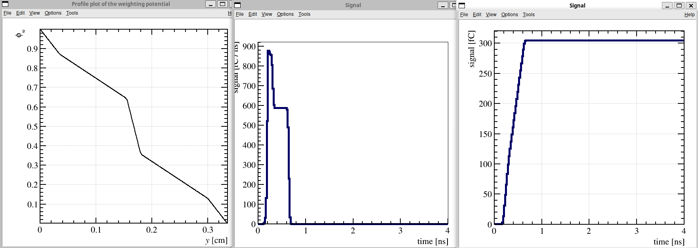
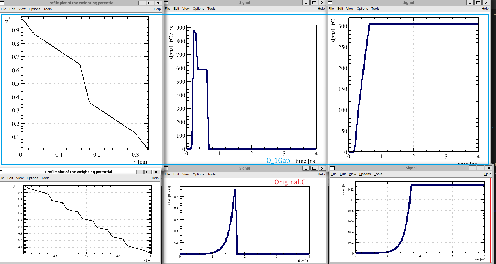
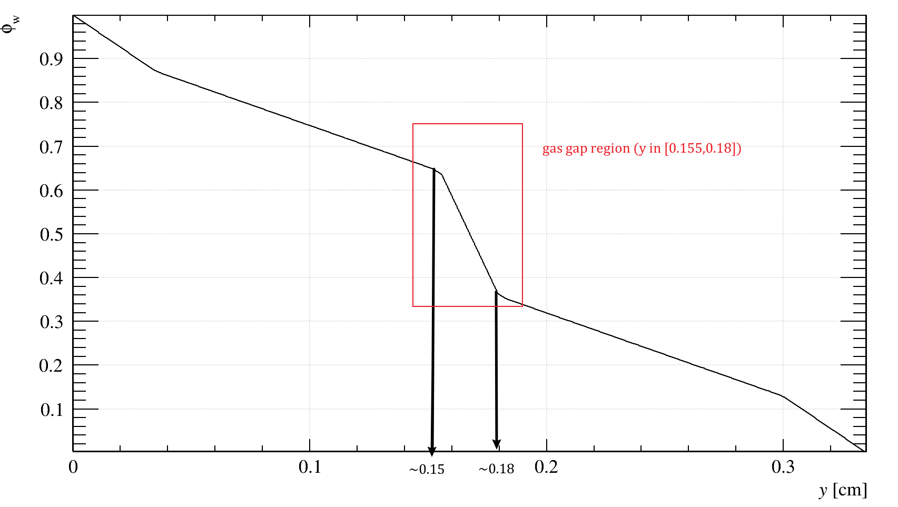
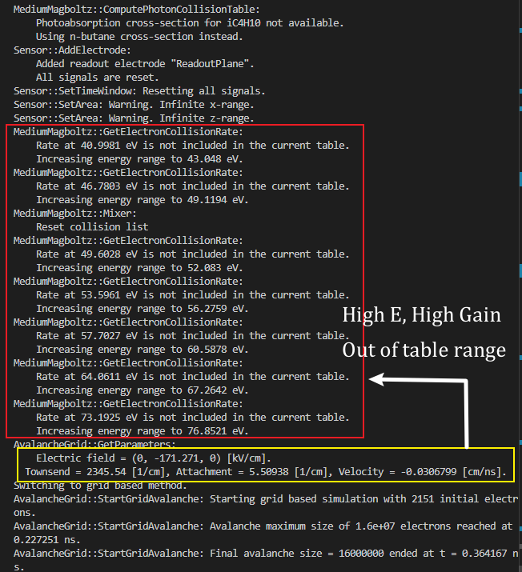

# Garfield code for simulating RPC signal response for photon detection

Author: Jing Tian Yong 
*This file is modified from Garfieldpp example code (Examples/RPC)

## Current Version: O_1Gap
### Version: **O_1Gap**
#### Files included
Source code:    Example/Original.C

### Description:
Simulate the signal and charge generated by a RPC modeled as a `Garfield::ComponentParallelPlate`. 

Components  :   `Garfield::ComponentParallelPlate`

Medium      :   `Garfield::MediumMagboltz`

Ionization  :   `Garfield::HEEDTrack`

Tracking    :   `Garfield::AvalancheMicroscopic`
                `Garfield::Avalanchegrid`

Data Readout     :   `Garfield::ViewSignal`
                `Garfield::ViewField`


# Modification compared to previous version. 
1. Change from multigap configuration to single gap configuration. The gap size, thickness of each layers and all the material properties are remained. Just only the number of layers are changed. 

#### **Before:** 
```cpp
  // Relative permitivity of the layers
  const double epMylar = 3.1;     // [1]
  const double epGlaverbel = 8.;  // [1]
  const double epWindow = 6.;     // [1]
  const double epGas = 1.;        // [1]
  std::vector<double> eps = {epMylar, epWindow,    epGas,  epGlaverbel,
                             epGas,   epGlaverbel, epGas,  epGlaverbel,
                             epGas,   epGlaverbel, epGas,  epGlaverbel,
                             epGas,   epWindow,    epMylar};

  // Thickness of the layers
  const double dMylar = 0.035;     // [cm]
  const double dGlaverbel = 0.07;  // [cm]
  const double dWindow = 0.12;     // [cm]
  const double dGas = 0.025;       // [cm]
  std::vector<double> thickness = {dMylar, dWindow,    dGas,  dGlaverbel,
                                   dGas,   dGlaverbel, dGas,  dGlaverbel,
                                   dGas,   dGlaverbel, dGas,  dGlaverbel,
                                   dGas,   dWindow,    dMylar};

// and 

std::cout<<"Total Thickness: "<<2*dMylar + 2*dWindow + 6*dGas +5*dGlaverbel<<std::endl; // = 0.81 cm 

```
#### **After:**
```cpp
  // Describe the geometry of the RPC.
  // Relative permitivity of the layers
  const double epMylar = 3.1;     // [1]
  const double epGlaverbel = 8.;  // [1]
  const double epWindow = 6.;     // [1]
  const double epGas = 1.;        // [1]
  std::vector<double> eps = {epMylar, epWindow,
                             epGas,   epWindow,    epMylar};

  // Thickness of the layers
  const double dMylar = 0.035;     // [cm]
  const double dGlaverbel = 0.07;  // [cm]
  const double dWindow = 0.12;     // [cm]
  const double dGas = 0.025;       // [cm]
  std::vector<double> thickness = {dMylar, dWindow,    
                                   dGas,   dWindow,    dMylar};

// and 

std::cout<<"Total Thickness: "<<2*dMylar + 2*dWindow + dGas<<std::endl; // = 0.335 cm
std::cout<<"Gas Gap: "<<2*dMylar + 2*dWindow + dGas - dMylar - dWindow << " to "<<dMylar+dWindow <<std::endl; //  Gas Gap: y = 0.18 cm to y = 0.155 cm
```

#### **Difference after change:**

Figure: All plots of figure. (Left) weighting potential. (Center) current. (Right) Charge.



We can observe that as the geometry changes, the signal is much different. Compare to original case, the signal magnitude has increased from `~0.5 fC/ns` (Original-Multigap Config) to `~900 fC/ns` (O_1Gap-Single Gap Config) and the charge increased from `~0.12 fC` (Original-Multigap Config) to `~300 fC` (O_1Gap-Single Gap Config). Compared to the multigap case, we notice that if we do not change the avalanche position and the position the track is generated, the single gap case has signal rising faster then the multigap case. 

For the profile of the single gap configuration, we can see that there is a linear relation of the potential across the center gas gap layer. 




The effective field across the gas gap is up to `-171.271 kV/cm`, this is because the voltage is unchanged (`15 kV`) but the thickness is decreased (from `0.81 cm` to `0.335`).

# Conclusion
1. Unchanging the voltage, multigap &rarr; single gap increase the field &rarr; high gain &rarr; large signal. 
2.

# Notes
### Workflow
#### Definition and Initialization
1. Define geometry, material properties, voltage for `Garfield::ComponentParallelPlate`.
2. Define medium under `Garfield::MediumMagboltz` (Define composition, initialize).
3. Set drift medium (`Garfield::MediumMagboltz`) and `Garfield::Sensor` (Add electrode from `Garfield::ComponentParallelPlate` components).
4. Define time bin for `Garfield::Sensor` time window (signal sampling time window).
5. Define `Garfield::AvalancheMicroscopic` & `Garfield::AvalancheGrid` class. 
    - Set tracking time window for `Garfield::AvalancheMicroscopic` and spatial grid size for `Garfield::AvalancheGrid`.
6. Define plot class `Garfield::ViewSignal` and `Garfield::ViewCharge`.
7. Define ionization track class `Garfield::TrackHeed`.
    - Set particle type [`Garfield::TrackHeed.SetParticle("string particlename")`]
    - Set particle momentum [`Garfield::TrackHeed.SetMomentum("string particlename")`]

#### Create tracks and process avalanche.
1. Start standard cpp clock `std::clock_t`
2. Generate a particle track for the particle we specify.
    - Define the initial point of the track in the gas layer with a displacement downwards.
3. Loop over all the clusters generated by tracking of the particle [`Garfield::TrackHeed.GetCluster`].
    - In every cluster, loop over all electrons [`Garfield::TrackHeed.clusters.electrons`].
        - For every electron, generate an electron avalanche process. For the first 0.1 ns (control by `const double tMaxWindow`), the avalanche process is tracked by `Garfield::AvalancheMicroscopic`. After `tMaxWindow`, the secondary electrons generated by the primary electrons (stored in `Garfield::AvalancheMicroscopic`) are passed to the `Garfield::AvalancheGrid`.
4. The `std::clock` is stoped. The runtime is recorded and printed on the log.

### Data visualization and plot. 
1. Two plot is generated using the `Garfield::ViewSignal` class.
    - The **current signal** is plotted over time over the 10 ns by the `Garfield::ViewSignal.PlotSignal(string label)` (controlled by `Garfield::Sensor.SetTimeWindow(double tmin, double tstep, double nTimeBins)`).
    - The **charge accumulated** over the entire signal is plotted over time over the 10 ns by integrating the signal using `Garfield::Sensor.IntegratesSignal(string label)`.
    - Export both the current and charge by `Garfield::Sensor.ExportSignal(string 'label', string 'optionQuantity')`.
2. The Weighting field profile (1D) is plotted using the `Garfield::ViewField` class.
    1. A canvas is first created to contain the plot of the field profile using `ROOT::TCanvas` class.
    2. The weighting potential is calculated using the `Garfield::ComponentParallelPlate.SetWeightingPotentialGrid(double xmin,double xmax, int xstep, double tmin, double ymax, int ystep, double ymin, double ymax, int ystep, string label)` in a grid basis within area [xmin, xmax] and [ymin, ymax], partitioned into grid points according to xstep and ystep.
    3. The calculated weighting potential values are plotted on the canvas using the `Garfield::ViewView.PlotProfileWeightingField(string label, double xmin, double ymin, double zmin, double xmax, double ymax, double zmax, string option='v', bool optionNormalized='true')` 
### Limitation
1. Only record the signal waveform of single event in csv by `ViewSignal`.
2. Using a gas table `c2h2f4_ic4h10_sf6.gas`.
3. Multigap RPC setup in `Garfield::ComponentParallelPlate`.
4. Signal registered from **Anode**.

