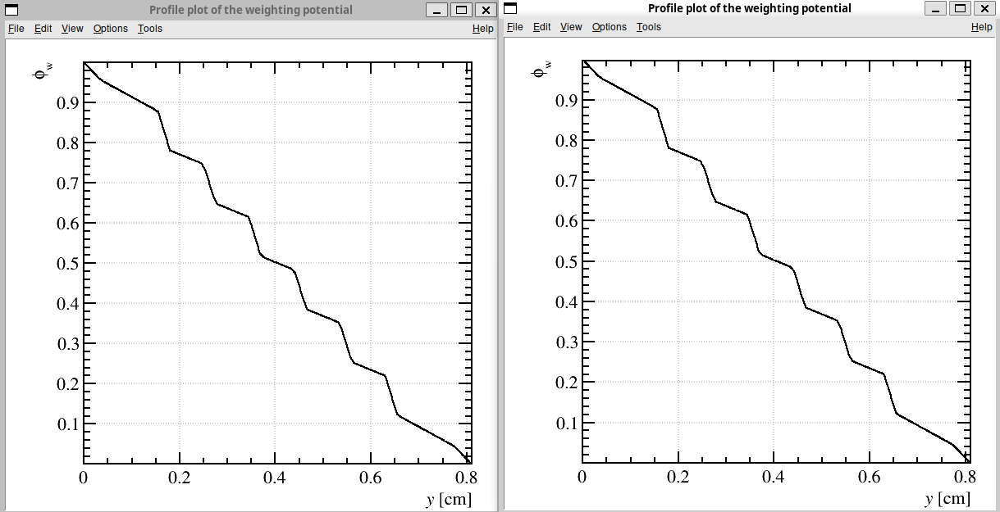
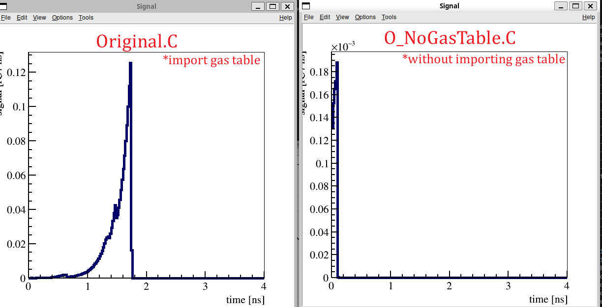
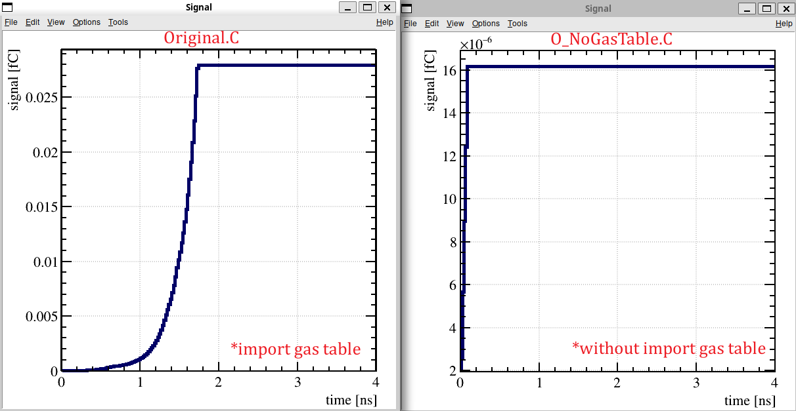

# Garfield code for simulating RPC signal response for photon detection

Author: Jing Tian Yong 
*This file is modified from Garfieldpp example code (Examples/RPC)

## Current Version: O_NoGasTable
### Version: **O_NoGasTable**
#### Files included
Source code:    Example/Original.C

### Description:
Simulate the signal and charge generated by a RPC modeled as a `Garfield::ComponentParallelPlate`. 

Components  :   `Garfield::ComponentParallelPlate`

Medium      :   `Garfield::MediumMagboltz`

Ionization  :   `Garfield::HEEDTrack`

Tracking    :   `Garfield::AvalancheMicroscopic`
                `Garfield::Avalanchegrid`

Data Readout     :   `Garfield::ViewSignal`
                `Garfield::ViewField`


# Modification compared to previous version. 
1. Change gas table method to non-gas table method:

#### **Before:**

```cpp
  MediumMagboltz gas;
  gas.LoadGasFile("c2h2f4_ic4h10_sf6.gas");
  gas.Initialise(true);
```
#### **After:**
```cpp
MediumMagboltz gas;
gas.SetComposition("C2H2F4",90.0,"iC4H10",5,"SF6",5);
gas.SetTemperature(296.15); 
gas.SetPressure(760.0);
gas.Initialise(true);
// This is exact configuration in "c2h2f4_ic4h10_sf6.gas"
```
#### **Difference in result:**

Figure: Weighting potential plot from `O_NoGasTable.C`(Left) and `Original.C`(Right).

We observe that both the files are almost identical in weighting potential.

However, the signals are very different for both the current and charge. 





I notice that the non gas table case signal has a signal started from a much higher value att `t=0 ns`.

**<em>Suspect that the signal of the non gas table method is bring forward compared to the gas table method.<em>**

## Notes
### Workflow
#### Definition and Initialization
1. Define geometry, material properties, voltage for `Garfield::ComponentParallelPlate`.
2. Define medium under `Garfield::MediumMagboltz` (Define composition, initialize).
3. Set drift medium (`Garfield::MediumMagboltz`) and `Garfield::Sensor` (Add electrode from `Garfield::ComponentParallelPlate` components).
4. Define time bin for `Garfield::Sensor` time window (signal sampling time window).
5. Define `Garfield::AvalancheMicroscopic` & `Garfield::AvalancheGrid` class. 
    - Set tracking time window for `Garfield::AvalancheMicroscopic` and spatial grid size for `Garfield::AvalancheGrid`.
6. Define plot class `Garfield::ViewSignal` and `Garfield::ViewCharge`.
7. Define ionization track class `Garfield::TrackHeed`.
    - Set particle type [`Garfield::TrackHeed.SetParticle("string particlename")`]
    - Set particle momentum [`Garfield::TrackHeed.SetMomentum("string particlename")`]

#### Create tracks and process avalanche.
1. Start standard cpp clock `std::clock_t`
2. Generate a particle track for the particle we specify.
    - Define the initial point of the track in the gas layer with a displacement downwards.
3. Loop over all the clusters generated by tracking of the particle [`Garfield::TrackHeed.GetCluster`].
    - In every cluster, loop over all electrons [`Garfield::TrackHeed.clusters.electrons`].
        - For every electron, generate an electron avalanche process. For the first 0.1 ns (control by `const double tMaxWindow`), the avalanche process is tracked by `Garfield::AvalancheMicroscopic`. After `tMaxWindow`, the secondary electrons generated by the primary electrons (stored in `Garfield::AvalancheMicroscopic`) are passed to the `Garfield::AvalancheGrid`.
4. The `std::clock` is stoped. The runtime is recorded and printed on the log.

### Data visualization and plot. 
1. Two plot is generated using the `Garfield::ViewSignal` class.
    - The **current signal** is plotted over time over the 10 ns by the `Garfield::ViewSignal.PlotSignal(string label)` (controlled by `Garfield::Sensor.SetTimeWindow(double tmin, double tstep, double nTimeBins)`).
    - The **charge accumulated** over the entire signal is plotted over time over the 10 ns by integrating the signal using `Garfield::Sensor.IntegratesSignal(string label)`.
    - Export both the current and charge by `Garfield::Sensor.ExportSignal(string 'label', string 'optionQuantity')`.
2. The Weighting field profile (1D) is plotted using the `Garfield::ViewField` class.
    1. A canvas is first created to contain the plot of the field profile using `ROOT::TCanvas` class.
    2. The weighting potential is calculated using the `Garfield::ComponentParallelPlate.SetWeightingPotentialGrid(double xmin,double xmax, int xstep, double tmin, double ymax, int ystep, double ymin, double ymax, int ystep, string label)` in a grid basis within area [xmin, xmax] and [ymin, ymax], partitioned into grid points according to xstep and ystep.
    3. The calculated weighting potential values are plotted on the canvas using the `Garfield::ViewView.PlotProfileWeightingField(string label, double xmin, double ymin, double zmin, double xmax, double ymax, double zmax, string option='v', bool optionNormalized='true')` 
### Limitation
1. Only record the signal waveform of single event in csv by `ViewSignal`. Only 1D weighting potential distribution is plotted.
2. Using a gas table `c2h2f4_ic4h10_sf6.gas`.
3. Multigap RPC setup in `Garfield::ComponentParallelPlate`.
4. Signal registered from **Anode**.

